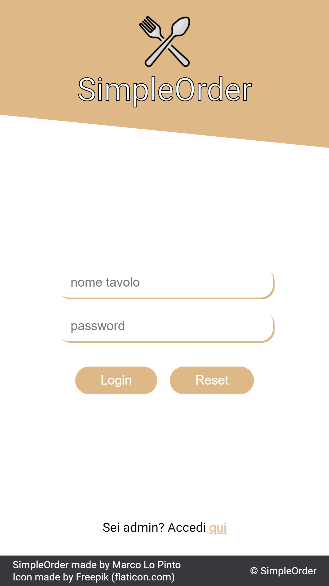

# 

This is a project that I created for fun in my spare time many years ago. Although it can be used to manage restaurant orders, it was not intended for production use.

For more detailed information, see the [User Manual](docs/doc.pdf) (in italian).

## Overview

SimpleOrder is a responsive web application designed to streamline the ordering and table management process for restaurants. This solution allows customers to place orders directly from their tables using a web interface, reducing contact and improving service efficiency.

  

## Features

- **User Authentication:** Customers can log in using a table number and a password provided by the restaurant.
- **Interactive Menu:** Users can browse the menu, select dishes, and specify quantities before placing their order.
- **Real-Time Order Management:** Orders are sent in real time to the restaurant's administration page, allowing for efficient tracking and management.
- **Table Management:** Admins can create, delete, and manage tables including viewing current orders and generating bills.
- **Menu Management:** Admins can add, edit, or remove dishes and categories from the menu.
- **Responsive Design:** The WebApp is fully responsive, designed to work seamlessly on smartphones, PCs, and tablets.